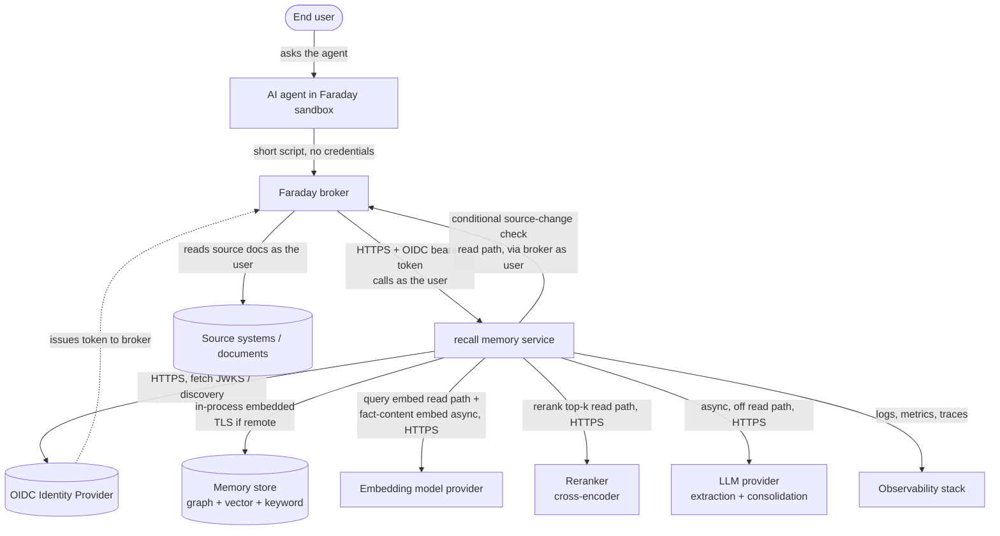

# 01 — System Context

> **Mode:** draft · **Revision:** 0.4.1 · **Last updated:** 2026-06-20

`recall` is a network service called by the Faraday broker on behalf of an end user, backed by a
memory store and assisted by external model providers for the asynchronous write/maintenance path.

### External actors and neighbouring systems

- **End user** — the human whose question ultimately drives a memory operation. **Interaction:**
  indirect; never talks to `recall` directly. Identity flows through the broker.
- **AI agent (Faraday sandbox)** — writes the short script that uses memory; runs sealed, holds no
  credentials. **Interaction:** indirect, via the broker. Treats `recall` responses as untrusted data.
- **Faraday broker** — the trusted caller. Authenticates as the end user, injects an OIDC bearer
  token, enforces the system allowlist and Faraday-side audit. **Interaction:** HTTPS to `recall`'s
  API; `Authorization: Bearer <OIDC JWT>`; direction broker→`recall`, plus a re-entrant `recall`→broker
  call for a **cheap conditional source-change check** on the read path (any actual source re-read is
  enqueued and runs asynchronously — ADR-013; outbound shape in [08 — Interfaces](./08-interfaces.md)).
- **OIDC Identity Provider** — issues and signs the bearer tokens the broker carries, and exposes
  discovery + JWKS endpoints `recall` uses to validate them. **Interaction:** the broker obtains
  tokens; `recall` fetches `.well-known/openid-configuration` and the JWKS over HTTPS. IdP is
  configuration, not committed to a specific vendor.
- **Memory store** — the persistence layer providing graph, vector, and keyword retrieval over
  bi-temporal facts. **Interaction:** **embedded SurrealDB, in-process** by default (ADR-003,
  ADR-009) — no network hop; can also run as a remote SurrealDB / TiKV cluster over TLS for scale-out.
  The validating spike is tracked in Open Question OQ-STORE.
- **Embedding model provider** — turns text into vectors for similarity search. **Interaction:**
  `recall`→provider, HTTPS, on **two distinct paths**: **fact-content embedding** is computed at write
  time and cached (asynchronous, off the read path); **query embedding** is computed per request on the
  **synchronous read path** (a novel query cannot be a cached vector) and counts against the read-path
  latency budget (NFR-P2/P3, ADR-012). A local/in-process embedder is the mitigation if a remote hop
  is too slow.
- **Reranker (cross-encoder)** — scores the top stage-1 candidates against the query for fine-grained
  relevance. **Interaction:** `recall`→provider, HTTPS, on the **synchronous read path** over a bounded
  candidate set. A discriminative model inference, **not an LLM call**, so it respects NFR-P1 while
  still consuming read-path latency (ADR-005, ADR-012).
- **LLM provider** — performs fact extraction and consolidation reasoning. **Interaction:**
  `recall`→provider, HTTPS, **asynchronous only**; never invoked on the synchronous read path. This is
  the call NFR-P1 ("no LLM calls on the read path") forbids on the read path.
- **Source systems / documents** — the documents memory is learned from and whose freshness is
  checked. **Interaction:** read **by the broker as the user**, never by `recall` directly, so source
  access rights are enforced by the source systems (no central master-permission store).
- **Observability stack** — receives structured logs, metrics, and traces. **Interaction:**
  `recall`→stack, push or scrape per project default.

### Trust boundaries

- The broker is the only authenticated caller of the API; `recall` trusts the OIDC token's issuer, not
  the request body, for identity.
- Content returned from source systems is **untrusted**: it is data to remember, never instructions
  to act on, and it passes the write gate before entering memory.
- `recall` holds no end-user credentials; it validates tokens and accesses only its own store and the
  model providers it is configured for.
