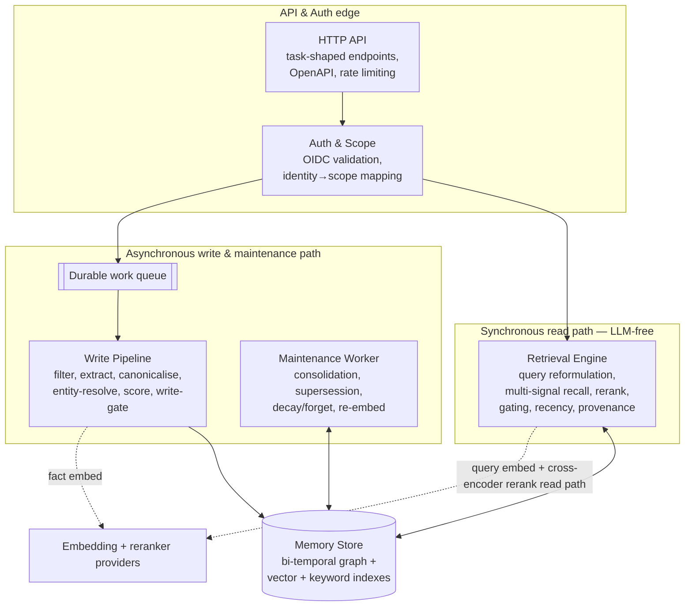

# 02 — System Architecture

> **Mode:** draft · **Revision:** 0.7.0 · **Last updated:** 2026-06-27

`recall` is internally split along one principal seam: a **fast synchronous read path** and a **slow
asynchronous write/maintenance path**, sharing one hybrid store. This seam is the central
architectural decision (see ADR-004) — it keeps LLM and embedding latency off the path the user waits
on.

### Component responsibilities

- **Service Layer** — the **transport-agnostic core** (ADR-016) every operation runs through: it
  authenticates the bearer to a `ScopeContext` (via Auth & Scope), authorises the operation class,
  applies rate limiting and idempotency, invokes the owning component, writes the per-call append-only
  audit record, and classifies any failure to a single error `code`. It is keyed on a verified
  `ScopeContext` and transport-neutral request/response types, and returns a typed result or a typed
  error — it knows nothing of HTTP or MCP. Owns: orchestration and governance enforcement.
  Depends on: Auth & Scope, Memory Store, Durable work queue, Retrieval Engine.
- **HTTP API edge** — a **thin transport adapter** (ADR-016) over the Service Layer: terminates HTTPS,
  exposes the small set of task-shaped endpoints (recall / remember / forget / get / capabilities),
  serves the OpenAPI contract, maps the REST wire format (headers / JSON / status codes / envelopes) to
  and from the Service Layer, and renders error `code`s as HTTP statuses. Its external contract is
  unchanged by the extraction. Owns: the REST contract. Depends on: Service Layer.
- **MCP API edge** — a second **thin transport adapter** (ADR-016), shipped as a separate binary
  (`recall-mcp`): exposes the same service operations as **MCP tools over streamable-HTTP**, advertises
  them via native tool discovery, carries the same broker-injected OIDC bearer as REST, and renders
  error `code`s as MCP tool/protocol errors. Owns: the MCP contract. Depends on: Service Layer.
- **Auth & Scope** — validates the OIDC bearer token (signature via JWKS, issuer, audience, expiry),
  derives the caller identity from a token claim, maps it to the owning memory scope, and enforces
  per-operation authorisation. Every downstream operation is scoped here; nothing trusts a
  scope value from the request body. Owns: identity→scope mapping, authorisation. Depends on: the
  configured OIDC provider's discovery/JWKS.
- **Retrieval Engine** (synchronous, **LLM-free but not model-free**) — embeds the query (a read-path
  model inference; the only embedding done at read time), runs multi-signal stage-1 recall (semantic +
  keyword + graph) with scope and metadata filters, reranks the top candidates with a **cross-encoder**
  (a second read-path model inference — a discriminative model, not an LLM), applies retrieval gating
  and recency weighting, and returns ranked facts with provenance and confidence. **Query reformulation
  is optional and A/B-gated, off by default** — `good-mem.md` §7.3 reports it can underperform plain
  dense retrieval. The two read-path model inferences (query embed, rerank) carry their own latency
  sub-budgets inside NFR-P2 (ADR-012). For facts that cite a source, it returns the stored provenance
  (`origin_ref` + `modification_marker`) **on request** (a recall request parameter) so the **agent**
  can verify freshness itself; `recall` performs no source-change check (ADR-014). Owns: the read path.
  Depends on: Memory Store, the embedding + reranker providers.
- **Durable work queue** — decouples ingestion and maintenance from the request, so a slow or failed
  write never blocks a read and writes are retry-safe. Owns: async hand-off. Depends on: nothing
  internal.
- **Write Pipeline** (asynchronous) — accepts **agent-asserted structured facts** (no LLM extraction —
  ADR-015), filters noise, normalises, resolves entity identity (rules→ML→create-new in v1; LLM
  adjudication deferred — see [10 — Risks](./10-risks.md)), scores importance and confidence, and
  applies the write gate (trust scoring; quarantine/reject untrusted content) before persisting. Owns:
  clean ingestion. Depends on: Memory Store, Embedding provider.
- **Maintenance Worker** (asynchronous, idle-biased) — detects and supersedes contradictions, applies
  graceful decay with the salience floor, performs verifiable deletion, and re-embeds facts whose
  content changed or whose embedding-model version is stale. **Consolidation is agent-side (ADR-015)** —
  the worker performs no episodic→semantic consolidation and makes no LLM call.
  Owns: keeping memory true and bounded over time. Depends on: Memory Store, Embedding provider.
- **Memory Store** — one hybrid multi-model store holding the bi-temporal knowledge graph with vector
  and keyword indexes; rich edges carry validity interval, ingestion time, confidence, salience, and
  source. Runs **in-process (embedded SurrealDB)** by default; the same engine abstraction can target
  a remote SurrealDB / TiKV cluster for scale-out. Tenant isolation is structural — **one namespace
  per tenant** — with logical Team / User scoping inside (ADR-011). Owns: persistence and the three
  retrieval signals. Depends on: nothing internal. (ADR-003, ADR-009, ADR-011.)
