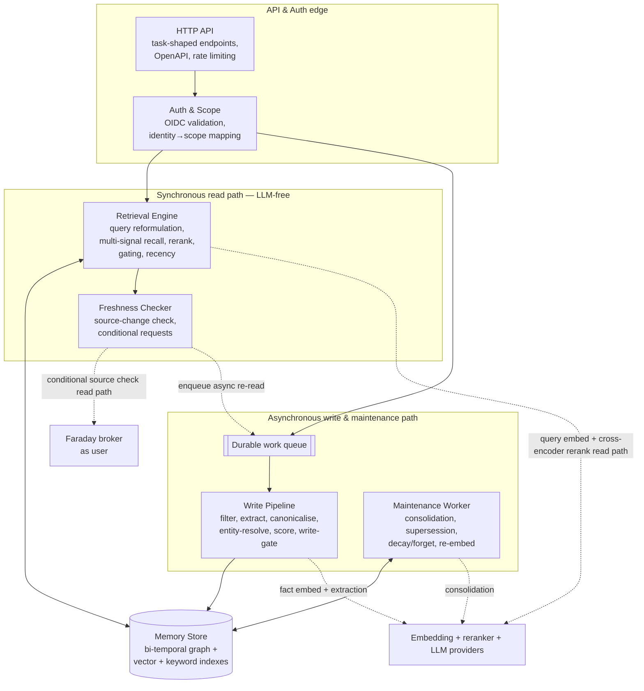

# 02 — System Architecture

> **Mode:** draft · **Revision:** 0.4.1 · **Last updated:** 2026-06-20

`recall` is internally split along one principal seam: a **fast synchronous read path** and a **slow
asynchronous write/maintenance path**, sharing one hybrid store. This seam is the central
architectural decision (see ADR-004) — it keeps LLM and embedding latency off the path the user waits
on.

### Component responsibilities

- **HTTP API edge** — terminates HTTPS, exposes the small set of task-shaped endpoints (recall /
  remember / forget / freshness-check / capabilities), serves the OpenAPI contract, applies
  agent-aware rate limiting, enforces the consistent success/error envelope, and writes the per-call
  **append-only audit record** (subject, operation, scope, outcome, token `jti`) — see Cross-cutting →
  Audit for where it is stored. Owns: the external contract and audit emission. Depends on: Auth & Scope.
- **Auth & Scope** — validates the OIDC bearer token (signature via JWKS, issuer, audience, expiry),
  derives the caller identity from a token claim, maps it to the owning memory scope, and enforces
  per-operation authorisation. Every downstream operation is scoped here; nothing trusts a
  scope value from the request body. Owns: identity→scope mapping, authorisation. Depends on: the
  configured OIDC provider's discovery/JWKS.
- **Retrieval Engine** (synchronous, **LLM-free but not model-free**) — embeds the query (a read-path
  model inference; the only embedding done at read time), runs multi-signal stage-1 recall (semantic +
  keyword + graph) with scope and metadata filters, reranks the top candidates with a **cross-encoder**
  (a second read-path model inference — a discriminative model, not an LLM), applies retrieval gating
  and recency weighting, and returns ranked facts with provenance and confidence. **Query reformulation
  is optional and A/B-gated, off by default** — `good-mem.md` §7.3 reports it can underperform plain
  dense retrieval. The two read-path model inferences (query embed, rerank) carry their own latency
  sub-budgets inside NFR-P2 (ADR-012). Owns: the read path. Depends on: Memory Store, Freshness Checker,
  the embedding + reranker providers.
- **Freshness Checker** — for facts whose source may have changed, performs a **cheap conditional
  source-change check** (modification marker / `If-Modified-Since`) via the broker, as the user. This
  check is the *only* freshness work on the read path; when it reports a change, the actual source
  re-read and re-extraction are **enqueued and run asynchronously**, and the answer flags the fact
  *stale-pending-refresh*. If the broker or source is unreachable, the stored fact is returned flagged
  *unverified-currency* rather than blocking. The recall-side placement and this sync-check /
  async-reread split are committed in ADR-013. Owns: currency verification. Depends on: the broker, the
  work queue.
- **Durable work queue** — decouples ingestion and maintenance from the request, so a slow or failed
  write never blocks a read and writes are retry-safe. Owns: async hand-off. Depends on: nothing
  internal.
- **Write Pipeline** (asynchronous) — filters noise, extracts structured facts (single-pass,
  including agent-stated facts), normalises, resolves entity identity (rules→ML→create-new in v1; LLM
  adjudication deferred — see [10 — Risks](./10-risks.md)), scores
  importance and confidence, and applies the write gate (trust scoring; quarantine/reject untrusted
  content) before persisting. Owns: clean ingestion. Depends on: Memory Store, Embedding + LLM
  providers.
- **Maintenance Worker** (asynchronous, idle-biased) — runs consolidation (episodic→semantic with
  validation-before-promotion and uncertainty decay), detects and supersedes contradictions, applies
  graceful decay with the salience floor, performs verifiable deletion, and re-embeds facts whose
  content changed or whose embedding-model version is stale.
  Owns: keeping memory true and bounded over time. Depends on: Memory Store, LLM provider.
- **Memory Store** — one hybrid multi-model store holding the bi-temporal knowledge graph with vector
  and keyword indexes; rich edges carry validity interval, ingestion time, confidence, salience, and
  source. Runs **in-process (embedded SurrealDB)** by default; the same engine abstraction can target
  a remote SurrealDB / TiKV cluster for scale-out. Tenant isolation is structural — **one namespace
  per tenant** — with logical Team / User scoping inside (ADR-011). Owns: persistence and the three
  retrieval signals. Depends on: nothing internal. (ADR-003, ADR-009, ADR-011.)
