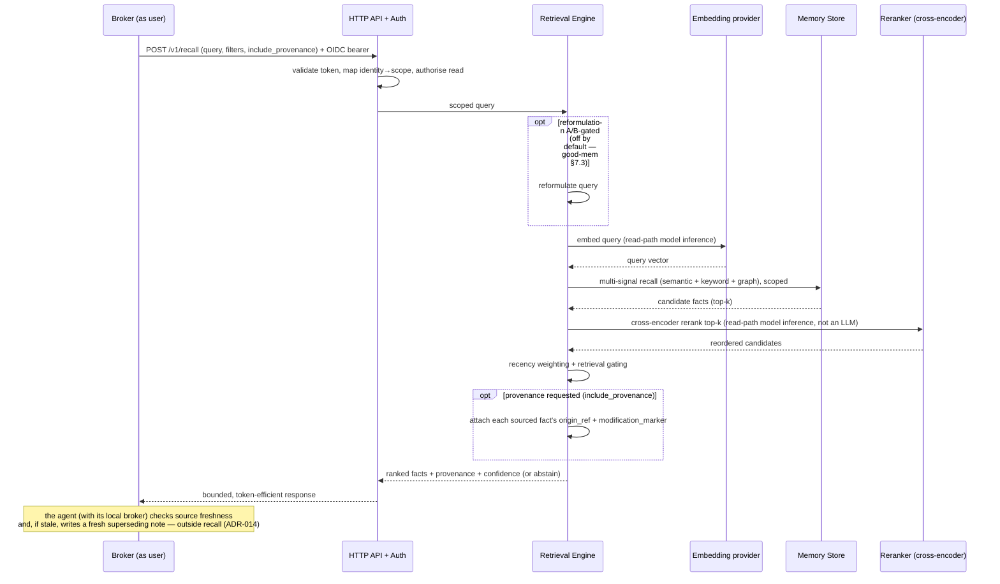
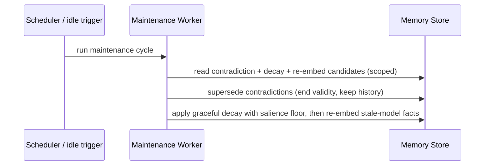
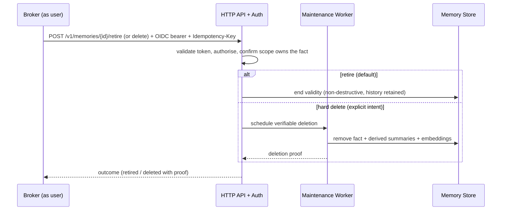

# 03 — Principal Sequences

> **Mode:** draft · **Revision:** 0.6.0 · **Last updated:** 2026-06-22

Logical order-of-operations for the four principal flows. Payload detail is deferred to `/spec`.

## Sequence: Recall (golden path)



- **Trigger:** the broker forwards a memory query on behalf of the user.
- **Result:** a ranked, scoped set of facts, each with source and confidence — or an explicit
  "insufficient evidence" abstention. **No LLM call on this path**; two read-path **model inferences**
  (query embed, cross-encoder rerank) run here and carry their own latency sub-budgets within NFR-P2
  (ADR-012). `recall` performs no source-change check; it returns each sourced fact's provenance on
  request so the **agent** verifies freshness and writes a fresh superseding note if stale (ADR-014).
- **Error posture:** invalid/expired token → reject (401-class); no sufficiently relevant candidate →
  abstain rather than pad; store timeout → fail fast with a typed error; embedding/reranker provider
  timeout → degrade within the ADR-012 budget (fail fast, or skip rerank and return stage-1 order).

## Sequence: Remember (write)

```mermaid
sequenceDiagram
    participant Broker as Broker (as user)
    participant API as HTTP API + Auth
    participant Q as Durable work queue
    participant WP as Write Pipeline
    participant Store as Memory Store

    Broker->>API: POST /v1/memories (content, source) + OIDC bearer + Idempotency-Key
    API->>API: validate token, map scope, authorise write
    API->>Q: enqueue write job (idempotency-keyed)
    API-->>Broker: accepted (idempotent ack)
    Q->>WP: dequeue
    WP->>WP: filter → normalise → entity-resolve → score importance+confidence (content arrives structured; no LLM extraction, ADR-015)
    WP->>WP: write gate (trust score)
    alt trusted
        WP->>Store: persist fact (provenance, validity, scores)
    else untrusted / instruction-like
        WP->>Store: quarantine or reject (distinguishable outcome)
    end
```

- **Trigger:** the broker submits content to remember.
- **Result:** a clean, scoped, provenance-tagged fact in the store (or a quarantined/rejected record);
  contradiction resolution is deferred to maintenance.
- **Error posture:** replay with same Idempotency-Key → original result, no duplicate; extraction/
  embedding provider failure → bounded retry with backoff, then dead-letter for later reprocessing;
  write never blocks a read.

## Sequence: Maintain (asynchronous, idle-biased)



- **Trigger:** schedule or idle period.
- **Result:** contradictions superseded (history retained), stale low-salience facts decayed,
  embeddings refreshed. **No consolidation here** — the agent distils episodes into insights and writes
  them back as agent-stated `consolidated` facts (ADR-015); the worker makes no LLM call.
- **Error posture:** a failed maintenance cycle leaves prior memory intact (no destructive step);
  inferences carry expiring confidence so a wrong one self-heals.

## Sequence: Forget / verifiable deletion



- **Trigger:** the broker requests a fact be forgotten, or a user exercises deletion rights.
- **Result:** the fact is retired (validity ended) by default, or hard-deleted — including from
  derived summaries and embeddings — with proof on explicit intent.
- **Error posture:** scope mismatch → reject (the caller does not own the fact); partial deletion →
  the operation is not reported complete until proof is obtained.
