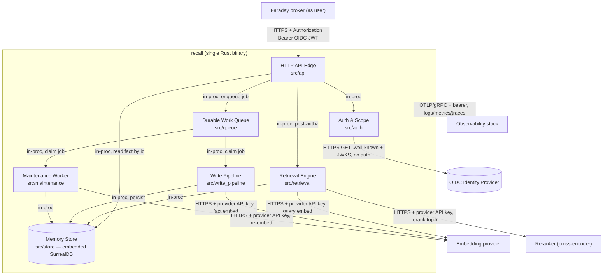

# Phase 2 — Architecture Artefacts

> **Spec set:** `recall` (agentic memory service) · **Mode:** greenfield
> **derivedFromHld:** 0.6.0 · **Source HLD:** `docs/design/agentic-memory/` · **Authored:** 2026-06-20 · **Amended:** 2026-06-22 (RFC 01, ADR-014; RFC 02, ADR-015)

## Table of contents

- [2A — System Context Diagram](#2a--system-context-diagram)
- [2B — Component Inventory](#2b--component-inventory)
- [2C — Shared Types Catalogue](#2c--shared-types-catalogue)
- [2D — Configuration & Environment Variables](#2d--configuration--environment-variables)

Stack is committed by the HLD and is binding for every component spec: **Rust** (ADR-009), `tokio`
async runtime + `axum` HTTP, **embedded SurrealDB** (ADR-003/009), store-backed durable work queue
(SA-QUEUE-01), `openidconnect`/`jsonwebtoken` for OIDC (ADR-001), `opentelemetry` for
logs/metrics/traces. One crate, `recall`, with one module per component under `src/`.

---

## 2A — System Context Diagram

Every arrow is labelled with protocol + authentication. Internal in-process calls are Rust function
calls (no network, no auth hop) and are labelled `in-proc`.



**Trust boundaries (from HLD 01):** the broker is the only authenticated API caller; identity is
trusted from the OIDC token's issuer, never from the request body; source content is untrusted data,
gated on the write path; `recall` holds no end-user credentials.

---

## 2B — Component Inventory

`Type`: `service-component` (owns a flow) · `infrastructure` (cross-component substrate) ·
`store` (persistence). `Phase` is the build order (a valid DAG — each component depends only on
lower-numbered phases). `Complexity`: S/M/L/XL relative effort.

| # | Component | Type | Phase | Dependencies (internal) | Complexity |
|---|---|---|---|---|---|
| C1 | **Memory Store** (`src/store`) | store | 1 | none | XL |
| C2 | **Durable Work Queue** (`src/queue`) | infrastructure | 2 | C1 | M |
| C3 | **Auth & Scope** (`src/auth`) | service-component | 2 | none (shared types only) | L |
| C4 | **Write Pipeline** (`src/write_pipeline`) | service-component | 3 | C1, C2 | XL |
| ~~C5~~ | ~~**Freshness Checker**~~ | — | — | — | **Retired by ADR-014** — freshness is agent-side; `recall` performs no source-change check. The id `C5` is retired (not reused) to keep C6/C7/C8 stable. |
| C6 | **Retrieval Engine** (`src/retrieval`) | service-component | 4 | C1 | XL |
| C7 | **Maintenance Worker** (`src/maintenance`) | service-component | 4 | C1, C2 | XL |
| C8 | **HTTP API Edge** (`src/api`) | service-component | 5 | C1, C2, C3, C6 | L |

**Dependency DAG (build order):**

```
C1 Memory Store
 ├─> C2 Work Queue ─┐
 │                  ├─> C4 Write Pipeline
 │                  └─> C7 Maintenance
 ├──────────────────────────────────────> C6 Retrieval ─┐
 └──────────────────────────────────────> C8 (store)    │
C3 Auth & Scope ─────────────────────────────────────> C8 HTTP API Edge
```

No cycles: every edge points from a lower phase to a higher one. C6 Retrieval depends only on C1
(C5 Freshness Checker is retired — ADR-014). The HTTP API Edge (C8) reaches the Write Pipeline only
indirectly, by enqueuing on C2 — the write path is asynchronous (ADR-004), so there is no synchronous
C8→C4 edge.

**External provider adapters** (`EmbeddingClient`, `RerankClient`,
`PiiDetector`) are not separate components — they are trait abstractions defined in 2C and injected
into the components that use them. They live under `src/providers/` as thin HTTP adapters and carry no
domain logic, so they need no standalone Phase 3 spec; their contracts are the traits in 2C.

---

## 2C — Shared Types Catalogue

Every type used by more than one component. Defined once here; **duplicated into the Shared Context
of each consuming spec** (never cross-referenced). Rust definitions with `serde` (JSON) and SurrealDB
mapping notes. All public API JSON uses `snake_case` field names.

### 2C.1 — Response envelopes

```rust
// src/types/envelope.rs   Used by: C8 (every handler); shape mirrored by all error producers.

/// Success envelope. Every 2xx body is exactly this shape.
#[derive(Serialize)]
pub struct Success<T: Serialize> {
    pub data: T,
    pub meta: Meta,
}

#[derive(Serialize, Default)]
pub struct Meta {
    #[serde(skip_serializing_if = "Option::is_none")]
    pub next_cursor: Option<String>,   // opaque pagination cursor (SA-PAGE-01)
    #[serde(skip_serializing_if = "Option::is_none")]
    pub abstained: Option<bool>,       // true on a recall that gated out all candidates
    pub correlation_id: String,        // uuid, echoes the per-request id
}

/// Error envelope. Every non-2xx body is exactly this shape.
#[derive(Serialize)]
pub struct ErrorEnvelope {
    pub error: ErrorBody,
}

#[derive(Serialize)]
pub struct ErrorBody {
    pub code: String,        // SCREAMING_SNAKE_CASE, from the Phase 4 error registry (SA-ENV-02)
    pub message: String,     // human-readable, never leaks internal state or PII
    pub correlation_id: String,
}
```

**Validation:** `code` MUST be a registered value (Phase 4 Error Handling). `correlation_id` MUST be
present on every response. **Used by:** C8 (emits), all components (produce typed errors mapped here).

### 2C.2 — Domain entities

```rust
// src/types/domain.rs   Used by: C1, C4, C6, C7 (and C8 for GET fact).

#[derive(Serialize, Deserialize, Clone)]
pub struct Fact {
    pub id: String,                       // "fact:<uuidv7>" (SA-ID-01)
    pub content: serde_json::Value,       // structured assertion (object), not free text
    pub entities: Vec<String>,            // entity ids this fact connects (>=1)
    pub source_id: Option<String>,        // "source:<uuidv7>" provenance, null for agent-stated
    pub memory_class: MemoryClass,
    pub visibility: Visibility,
    pub owner: ScopeRef,                  // owning (tenant, team, user)
    pub valid_from: DateTime<Utc>,        // RFC3339 ms (SA-TIME-01)
    pub valid_to: Option<DateTime<Utc>>,  // null = currently true (open interval)
    pub ingested_at: DateTime<Utc>,       // server-set
    pub confidence: f64,                  // [0,1] (SA-SCORE-01)
    pub salience: f64,                    // [0,1]
    pub stability: f64,                   // decay stability `s` (SA-DECAY-01), >=0.0
    pub pii_review: bool,                 // true => low-confidence PII flagged for review (SA-PII-01)
    pub supersedes: Option<String>,       // fact id this one replaces
    pub superseded_by: Option<String>,    // fact id replacing this one
    pub derived_from: Vec<String>,        // source fact ids (consolidated insights only)
    pub last_recalled_at: Option<DateTime<Utc>>,
}

#[derive(Serialize, Deserialize, Clone)]
pub struct Entity {
    pub id: String,                       // "entity:<uuidv7>"
    pub canonical_name: String,           // 1..=512 chars, non-empty
    pub aliases: Vec<String>,
    pub owner: ScopeRef,
}

#[derive(Serialize, Deserialize, Clone)]
pub struct Relationship {
    pub id: String,                       // "relationship:<uuidv7>"
    pub kind: String,                     // typed edge label, e.g. "owns" (1..=128 chars)
    pub from: String,                     // entity id
    pub to: String,                       // entity id
    pub valid_from: DateTime<Utc>,
    pub valid_to: Option<DateTime<Utc>>,
    pub ingested_at: DateTime<Utc>,
    pub confidence: f64,                  // [0,1]
    pub source_id: Option<String>,
    pub owner: ScopeRef,
}

#[derive(Serialize, Deserialize, Clone)]
pub struct Source {
    pub id: String,                       // "source:<uuidv7>"
    pub origin_ref: String,               // document/system handle, opaque to recall
    pub modification_marker: Option<String>, // ETag / Last-Modified token for freshness
    pub trust_signal: f64,                // [0,1] prior trust of this source
    pub owner: ScopeRef,
}

#[derive(Serialize, Deserialize, Clone, Copy, PartialEq, Eq)]
#[serde(rename_all = "kebab-case")]
pub enum MemoryClass { Episodic, Semantic, Consolidated }   // procedural rejected (SA-CLASS-01)

#[derive(Serialize, Deserialize, Clone, Copy, PartialEq, Eq)]
#[serde(rename_all = "kebab-case")]
pub enum Visibility { UserPrivate, TeamShared, TenantShared } // (SA-VIS-01)
```

**Validation:** `entities.len() >= 1`; all score fields in `[0,1]`; `valid_to` (if present) `>=
valid_from`; `content` MUST be a JSON object. **SurrealDB mapping:** one table per type within the
tenant namespace (`fact`, `entity`, `relationship`, `source`); `entities`/`from`/`to` are SurrealDB
record links; `content` is a `flexible` object; a per-table HNSW vector index on the fact embedding
(2C.6) and a BM25 keyword index on serialised `content`. The persisted `fact` **row** additionally
carries two derived, persistence-only fields not part of the JSON `Fact` contract — `embedding:
option<array<float>>` (the fact-content vector for the HNSW index, written by C4, refreshed by C7) and
`embedding_model: option<string>` (the embedding-model version tag the C7 re-embed scan keys on);
these never appear in an API `Fact` payload. **Used by:** C1 (persists), C4 (writes),
C6 (reads/ranks), C7 (maintains), C8 (GET fact).

### 2C.3 — Scope & auth context

```rust
// src/types/scope.rs   Used by: C3 (produces), C1/C4/C6/C7/C8 (consume — every query is scoped).

/// The owning scope stored on every record.
#[derive(Serialize, Deserialize, Clone, PartialEq, Eq)]
pub struct ScopeRef {
    pub tenant: String,            // tenant id -> SurrealDB namespace (ADR-011)
    pub team: Option<String>,      // team id, null for user-only facts
    pub user: String,              // user id, bound to the OIDC subject claim
}

/// The authenticated request context derived by C3 from the validated token.
/// Never constructed from request-body input.
#[derive(Clone)]
pub struct ScopeContext {
    pub tenant: String,
    pub teams: Vec<String>,        // membership claim — teams the user belongs to
    pub user: String,              // = token subject claim
    pub token_jti: String,         // for the audit trail (never the token itself)
    pub allowed_ops: OpSet,        // read / write / forget, from token scopes
    pub correlation_id: String,
}

#[derive(Clone, Copy)]
pub struct OpSet { pub read: bool, pub write: bool, pub forget: bool }
```

**Read filter rule (binding for every store query):** a caller may read a Fact/Entity/Relationship
iff `record.owner.tenant == ctx.tenant` **and** ( `record.owner.user == ctx.user`
**or** (`record.visibility == TeamShared` and `record.owner.team ∈ ctx.teams`)
**or** `record.visibility == TenantShared` ). Cross-tenant access is structurally impossible — a
different tenant is a different namespace. **Used by:** C3 (builds `ScopeContext`), all data
components (apply the filter).

### 2C.4 — API request/response payloads

```rust
// src/types/api.rs   Used by: C8 (HTTP), C6 (recall), C4 (remember).

#[derive(Deserialize)]
pub struct RecallRequest {
    pub query: String,                       // 1..=4096 chars, non-empty
    #[serde(default)]
    pub filters: RecallFilters,
    #[serde(default = "default_result_cap")]
    pub result_cap: u8,                      // [1,50], default 10 (SA-CAP-01)
    #[serde(default)]
    pub cursor: Option<String>,              // opaque, from a prior meta.next_cursor
    #[serde(default)]
    pub include_provenance: bool,            // opt-in: attach source origin_ref + marker (SA-PROV-01)
}

#[derive(Deserialize, Default)]
pub struct RecallFilters {
    pub memory_class: Option<MemoryClass>,
    pub visibility: Option<Visibility>,
    pub entity: Option<String>,              // restrict to facts touching this entity id
    pub valid_at: Option<DateTime<Utc>>,     // as-of query into the bi-temporal history
}

#[derive(Serialize)]
pub struct RecallResponse { pub facts: Vec<RankedFact> }   // wrapped in Success<RecallResponse>

#[derive(Serialize)]
pub struct RankedFact {
    pub fact: Fact,
    pub score: f64,                          // final ranking score [0,1]
    #[serde(skip_serializing_if = "Option::is_none")]
    pub source: Option<SourceProvenance>,    // present only when include_provenance and fact has a source (SA-PROV-01)
}

/// Returned per sourced fact when the recall request opts in (SA-PROV-01, ADR-014). Lets the agent
/// run its own source-freshness check; `recall` performs no check and asserts no currency.
#[derive(Serialize)]
pub struct SourceProvenance {
    pub origin_ref: String,                  // document/system handle the agent resolves
    #[serde(skip_serializing_if = "Option::is_none")]
    pub modification_marker: Option<String>, // ETag / Last-Modified token captured at write time
}

#[derive(Deserialize)]
pub struct RememberRequest {
    pub content: serde_json::Value,          // structured assertion object (the agent extracts; ADR-015)
    pub source: Option<SourceInput>,
    #[serde(default)]
    pub memory_class: Option<MemoryClass>,   // optional; default Episodic (SA-WRITE-STRUCTURED-01)
}

#[derive(Deserialize)]
pub struct SourceInput {
    pub origin_ref: String,
    pub modification_marker: Option<String>,
}

#[derive(Serialize)]
pub struct WriteAck { pub job_id: String, pub status: JobAckStatus }  // async (ADR-004)

#[derive(Serialize, Clone, Copy)]
#[serde(rename_all = "kebab-case")]
pub enum JobAckStatus { Accepted, AlreadyAccepted }   // AlreadyAccepted => idempotent replay

#[derive(Serialize)]
pub struct DeletionProof {
    pub deleted_at: DateTime<Utc>,
    pub record_id: String,
    pub derived_removed: Vec<String>,        // ids of removed derived summaries
    pub embeddings_removed: u32,
    pub digest: String,                      // sha256 hex over sorted removed ids (SA-DELETE-01)
}

fn default_result_cap() -> u8 { 10 }
```

**Used by:** C8 (deserialises requests, serialises responses), C6 (`RecallRequest`/`RankedFact`), C4
(`RememberRequest`), C7+C8 (`DeletionProof`).

### 2C.5 — Work queue types

```rust
// src/types/job.rs   Used by: C2 (transport), C4/C5/C7/C8 (produce/consume).

#[derive(Serialize, Deserialize, Clone)]
pub struct WorkJob {
    pub id: String,                          // "work_job:<uuidv7>"
    pub kind: JobKind,
    pub payload: serde_json::Value,          // kind-specific, validated by the consumer
    pub scope: ScopeRef,
    pub idempotency_key: Option<String>,     // present for API-originated writes
    pub attempts: u32,
    pub status: JobStatus,
    pub not_before: DateTime<Utc>,           // backoff schedule (SA-QUEUE-02)
    pub created_at: DateTime<Utc>,
    pub leased_until: Option<DateTime<Utc>>, // claim lease; null when unclaimed
}

#[derive(Serialize, Deserialize, Clone, Copy, PartialEq, Eq)]
#[serde(rename_all = "snake_case")]
pub enum JobKind { ExtractFact, ReEmbedFact, HardDelete }  // ReReadSource removed (ADR-014); Consolidate removed (ADR-015)

#[derive(Serialize, Deserialize, Clone, Copy, PartialEq, Eq)]
#[serde(rename_all = "snake_case")]
pub enum JobStatus { Pending, Leased, Done, DeadLetter }
```

**Used by:** C2 (owns the table + claim/lease), C4 (consumes `ExtractFact`), C7 (consumes
`ReEmbedFact`/`HardDelete`), C8 (produces `ExtractFact`, `HardDelete`).

### 2C.6 — Provider & infrastructure traits (dependency-injected)

```rust
// src/types/ports.rs   The seams that keep providers swappable (OQ-MODELS/OQ-QUEUE/OQ-STORE).

#[async_trait]
pub trait MemoryStore: Send + Sync {                 // impl: embedded SurrealDB (C1)
    // --- Fact CRUD + bi-temporal ---
    async fn put_fact(&self, f: &Fact) -> Result<(), StoreError>;        // upsert; embedding passed alongside
    async fn get_fact(&self, ctx: &ScopeContext, id: &str) -> Result<Option<Fact>, StoreError>;
    async fn recall(&self, ctx: &ScopeContext, q: &StageOneQuery)
        -> Result<Vec<Candidate>, StoreError>;                          // multi-signal stage-1
    async fn end_validity(&self, ctx: &ScopeContext, id: &str, at: DateTime<Utc>) -> Result<(), StoreError>;
    async fn supersede(&self, ctx: &ScopeContext, old_id: &str, new_id: &str, at: DateTime<Utc>)
        -> Result<(), StoreError>;
    async fn hard_delete(&self, ctx: &ScopeContext, id: &str) -> Result<DeletionProof, StoreError>;
    // --- Entity CRUD + resolution support ---
    async fn put_entity(&self, e: &Entity) -> Result<(), StoreError>;    // upsert
    async fn get_entity(&self, ctx: &ScopeContext, id: &str) -> Result<Option<Entity>, StoreError>;
    async fn find_entity_by_name(&self, ctx: &ScopeContext, name: &str) -> Result<Vec<Entity>, StoreError>;
    async fn merge_entities(&self, ctx: &ScopeContext, keep_id: &str, merge_id: &str) -> Result<(), StoreError>;
    // --- Relationship CRUD ---
    async fn put_relationship(&self, r: &Relationship) -> Result<(), StoreError>;
    async fn get_relationship(&self, ctx: &ScopeContext, id: &str) -> Result<Option<Relationship>, StoreError>;
    async fn end_relationship_validity(&self, ctx: &ScopeContext, id: &str, at: DateTime<Utc>) -> Result<(), StoreError>;
    // --- Source CRUD ---
    async fn put_source(&self, s: &Source) -> Result<(), StoreError>;    // upsert
    async fn get_source(&self, ctx: &ScopeContext, id: &str) -> Result<Option<Source>, StoreError>;
    // --- Audit (SA-AUDIT-01) ---
    async fn append_audit(&self, e: &AuditEntry) -> Result<(), StoreError>;   // append-only, synchronous
    // --- Maintenance surface consumed by C7 (all take ctx; ctx.tenant selects the namespace) ---
    async fn list_tenants(&self) -> Result<Vec<String>, StoreError>;          // admin op, no ctx
    async fn scan_recent_episodes(&self, ctx: &ScopeContext, since: DateTime<Utc>, limit: u32)
        -> Result<Vec<Fact>, StoreError>;
    async fn scan_contradiction_candidates(&self, ctx: &ScopeContext, limit: u32)
        -> Result<Vec<(Fact, Fact)>, StoreError>;
    async fn scan_decay_candidates(&self, ctx: &ScopeContext, salience_floor: f64, limit: u32)
        -> Result<Vec<Fact>, StoreError>;                                    // coarse prefilter; C7 owns the decay maths
    async fn scan_reembed_candidates(&self, ctx: &ScopeContext, current_model_version: &str, limit: u32)
        -> Result<Vec<Fact>, StoreError>;
    async fn update_fact_maintenance_fields(&self, ctx: &ScopeContext, f: &Fact) -> Result<(), StoreError>;
    async fn set_fact_embedding(&self, ctx: &ScopeContext, fact_id: &str, vector: &[f32], model_version: &str)
        -> Result<(), StoreError>;
    // --- Lifecycle / tenancy ---
    async fn ensure_tenant_namespace(&self, tenant: &str) -> Result<(), StoreError>;   // idempotent
    async fn drop_tenant_namespace(&self, tenant: &str) -> Result<(), StoreError>;      // ADR-011 erasure
    async fn ready(&self) -> Result<(), StoreError>;   // connection live + vector-index dim == RECALL_EMBED_DIM
}

// (Freshness tagging removed by ADR-014 — `recall` performs no source-change check; the agent does.)

#[async_trait]
pub trait WorkQueue: Send + Sync {                    // impl: store-backed (C2)
    async fn enqueue(&self, job: WorkJob) -> Result<String, QueueError>; // returns job id
    async fn claim(&self, kinds: &[JobKind], lease: Duration)
        -> Result<Option<WorkJob>, QueueError>;
    async fn complete(&self, job_id: &str) -> Result<(), QueueError>;
    async fn fail(&self, job_id: &str, retryable: bool) -> Result<(), QueueError>;
}

#[async_trait]
pub trait EmbeddingClient: Send + Sync {              // impl: HTTP adapter
    async fn embed(&self, texts: &[String]) -> Result<Vec<Vec<f32>>, ProviderError>; // dim = config
}

#[async_trait]
pub trait RerankClient: Send + Sync {                 // impl: HTTP adapter
    async fn rerank(&self, query: &str, docs: &[String]) -> Result<Vec<f64>, ProviderError>;
}

// (LlmClient removed by ADR-015 — recall is LLM-free: the agent extracts and consolidates; recall
// accepts structured agent-asserted facts. `ExtractedFact`/`EntityMention` remain as the C4-internal
// wrapper for structured content. `InsightCandidate` is removed with server-side consolidation.)

// (BrokerClient removed by ADR-014 — `recall` makes no outbound broker call.)

#[async_trait]
pub trait PiiDetector: Send + Sync {                  // impl: model/heuristic adapter
    async fn scan(&self, content: &serde_json::Value) -> Result<Vec<PiiSpan>, ProviderError>;
}
```

The three error/result types shared across every provider trait are defined **here** (one canonical
home), so all adapters share them:

```rust
// src/types/ports.rs (continued)

#[derive(thiserror::Error, Debug)]
pub enum ProviderError {                  // shared by EmbeddingClient/RerankClient/PiiDetector
    #[error("provider timeout")]          Timeout,            // -> 504 PROVIDER_TIMEOUT
    #[error("provider status {0}")]       Status(u16),        // -> 502 PROVIDER_ERROR
    #[error("provider transport: {0}")]   Transport(String),  // -> 502 PROVIDER_ERROR
    #[error("provider malformed: {0}")]   Malformed(String),  // -> 502 PROVIDER_ERROR
}

pub struct PiiSpan {                       // PiiDetector::scan result (C4)
    pub json_pointer: String,              // RFC 6901 pointer into `content`
    pub pii_type: String,                  // e.g. "email", "person", "phone"
    pub confidence: f64,                   // [0,1]
}
```

**Used by:** the trait is the contract; each consuming component spec (C1/C2/C4/C6/C7) duplicates
the exact signatures it depends on into its Shared Context. `StoreError` and the C1-owned
`Candidate`/`StageOneQuery`/`AuditEntry` are defined in full in the **C1 Memory Store** spec;
`QueueError` in **C2**; `ExtractedFact`/`EntityMention` in **C4** — each referenced by name here.
(`InsightCandidate` removed with server-side consolidation, ADR-015.) The full `MemoryStore` surface
above is canonical; C1 implements it exactly.

### 2C.7 — Typed application error

```rust
// src/error.rs   Used by: every component (produces) and C8 (maps to HTTP + ErrorBody).

/// Discriminator for the VAL_* family carried by AppError::Validation (the precise code is selected
/// by this kind, so one variant covers the whole VAL_* family).
pub enum ValidationKind { InvalidBody, OutOfRange, UnsupportedClass, MissingIdempotencyKey, BodyTooLarge }

/// Discriminator carried by AppError::Unauthenticated (selects AUTH_MISSING_TOKEN vs AUTH_INVALID_TOKEN).
pub enum AuthKind { Missing, Invalid }

#[derive(thiserror::Error, Debug)]
pub enum AppError {
    #[error("validation: {1}")]      Validation(ValidationKind, String),  // -> 400 VAL_* (code per kind)
    #[error("unauthenticated: {1}")] Unauthenticated(AuthKind, String),   // -> 401 AUTH_* (code per kind)
    #[error("forbidden: {0}")]       Forbidden(String),                   // -> 403 SCOPE_FORBIDDEN
    #[error("insufficient scope: {0}")] InsufficientScope(String),        // -> 403 AUTH_INSUFFICIENT_SCOPE
    #[error("not found")]            NotFound,                            // -> 404 NOT_FOUND
    #[error("rate limited")]         RateLimited,                         // -> 429 RATE_LIMITED
    #[error("store: {0}")]           Store(#[from] StoreError),           // -> 503 STORE_UNAVAILABLE / 504 STORE_TIMEOUT
    #[error("queue: {0}")]           Queue(#[from] QueueError),           // -> 503 QUEUE_UNAVAILABLE
    #[error("provider: {0}")]        Provider(#[from] ProviderError),     // -> 502/504 by kind
    #[error("internal")]             Internal,                            // -> 500 INTERNAL
}
```

The exact `AppError` → (HTTP status, `code`) mapping is the single registry in the Phase 4 Error
Handling spec. **Used by:** all components produce `AppError`; C8 owns the mapping.

---

## 2D — Configuration & Environment Variables

All configuration is loaded at startup with precedence **env var > config file > built-in default**
(Phase 4 Configuration spec). Secrets are read from env only and never logged. Startup fails fast on
a missing required value or a failed validation (e.g. embedding-dimension mismatch, SA-EMBED-01).

| Variable | Type | Default | Required | Owner Component | Description |
|---|---|---|---|---|---|
| `RECALL_HTTP_ADDR` | socket addr | `0.0.0.0:8080` | no | C8 | Bind address for the HTTP API. |
| `RECALL_STORE_PATH` | path | `./data/recall.db` | no | C1 | Embedded SurrealDB data directory (SurrealKV/RocksDB). |
| `RECALL_STORE_REMOTE_URL` | url | _(unset)_ | no | C1 | If set, target a remote SurrealDB/TiKV cluster instead of embedding (ADR-009 scale-out). |
| `RECALL_STORE_BACKEND` | enum `surrealkv\|rocksdb` | `surrealkv` | no | C1 | Embedded storage backend. |
| `RECALL_OIDC_ISSUER` | url | _(none)_ | **yes** | C3 | OIDC issuer; discovery at `<issuer>/.well-known/openid-configuration`. |
| `RECALL_OIDC_AUDIENCE` | string | _(none)_ | **yes** | C3 | Expected `aud` claim. |
| `RECALL_OIDC_SUBJECT_CLAIM` | string | `sub` | no | C3 | Claim mapped to the user id. |
| `RECALL_OIDC_TEAMS_CLAIM` | string | `groups` | no | C3 | Claim carrying team membership. |
| `RECALL_OIDC_TENANT_CLAIM` | string | `tenant` | no | C3 | Claim carrying the tenant id. |
| `RECALL_JWKS_REFRESH_SECS` | u32 | `3600` | no | C3 | JWKS background refresh interval (SA-JWKS-01). |
| `RECALL_EMBED_URL` | url | _(none)_ | **yes** | C4/C6 | Embedding provider endpoint. |
| `RECALL_EMBED_API_KEY` | secret | _(none)_ | **yes** | C4/C6 | Embedding provider key (env only). |
| `RECALL_EMBED_DIM` | u32 | `1024` | no | C1/C4/C6 | Embedding dimension; must equal the vector-index dimension (SA-EMBED-01). |
| `RECALL_RERANK_URL` | url | _(none)_ | **yes** | C6 | Cross-encoder reranker endpoint. |
| `RECALL_RERANK_API_KEY` | secret | _(none)_ | **yes** | C6 | Reranker key (env only). |
| `RECALL_QUEUE_BACKEND` | enum `store\|nats` | `store` | no | C2 | Work-queue backend (SA-QUEUE-01). |
| `RECALL_QUEUE_NATS_URL` | url | _(unset)_ | conditional | C2 | Required iff `RECALL_QUEUE_BACKEND=nats`. |
| `RECALL_JOB_MAX_ATTEMPTS` | u32 | `5` | no | C2 | Retry cap before dead-letter (SA-QUEUE-02). |
| `RECALL_JOB_BACKOFF_BASE_MS` | u32 | `2000` | no | C2 | Backoff base for job retries. |
| `RECALL_RESULT_CAP_MAX` | u8 | `50` | no | C6 | Hard upper bound on `result_cap` (SA-CAP-01). |
| `RECALL_STAGE1_K` | u16 | `50` | no | C6 | Stage-1 candidate count fed to rerank (SA-RERANK-01). |
| `RECALL_ABSTAIN_THRESHOLD` | f64 | `0.2` | no | C6 | Score below which recall abstains (SA-GATE-01). |
| `RECALL_RECENCY_WEIGHT` | f64 | `0.15` | no | C6 | Recency boost weight `w` (SA-RECENCY-01). |
| `RECALL_RECENCY_TAU_DAYS` | f64 | `30` | no | C6 | Recency decay constant `τ`. |
| `RECALL_TRUST_ADMIT` | f64 | `0.7` | no | C4 | Write-gate admit threshold (SA-WGATE-01). |
| `RECALL_TRUST_QUARANTINE` | f64 | `0.4` | no | C4 | Write-gate quarantine threshold. |
| `RECALL_PII_REDACT_CONF` | f64 | `0.9` | no | C4 | PII redaction confidence threshold (SA-PII-01). |
| `RECALL_SOURCE_TRUST_DEFAULT` | f64 | `0.5` | no | C4 | Prior trust assigned to a newly-seen source (write-gate scoring input). |
| `RECALL_SALIENCE_FLOOR` | f64 | `0.3` | no | C7 | Decay salience floor (SA-DECAY-01). |
| `RECALL_DECAY_K` | f64 | `10.0` | no | C7 | Global decay constant `k`. |
| `RECALL_PRUNE_RETRIEVABILITY` | f64 | `0.05` | no | C7 | Retrievability below which a low-salience fact is a prune candidate. |
| `RECALL_IDLE_QUIET_SECS` | u32 | `300` | no | C7 | Idle period before a maintenance cycle (SA-MAINT-CADENCE-01). |
| `RECALL_MAINT_MAX_INTERVAL_SECS` | u32 | `21600` | no | C7 | Hard fallback maintenance interval (6 h, SA-MAINT-CADENCE-01). Renamed from `RECALL_CONSOLIDATE_MAX_INTERVAL_SECS` (ADR-015). |
| `RECALL_IDEMPOTENCY_TTL_SECS` | u32 | `86400` | no | C8 | Idempotency-key retention window (SA-IDEM-01). |
| `RECALL_RATE_READ_PER_MIN` | u32 | `120` | no | C8 | Read-class rate limit (SA-RATE-01). |
| `RECALL_RATE_WRITE_PER_MIN` | u32 | `30` | no | C8 | Write-class rate limit. |
| `RECALL_MAX_BODY_BYTES` | u32 | `1048576` | no | C8 | Max request body (1 MiB; input-validation spec). |
| `RECALL_OTLP_ENDPOINT` | url | _(unset)_ | no | all | OpenTelemetry collector endpoint; observability disabled if unset. |
| `RECALL_LOG_LEVEL` | enum | `info` | no | all | `error\|warn\|info\|debug\|trace`. |
| `RECALL_ENV` | enum | `production` | no | all | `production\|development`; gates verbose error detail off in production. |
| `RECALL_QUEUE_REAPER_SECS` | u32 | `30` | no | C2 | Lease-reaper sweep cadence; expired leases revert to Pending (SA-QUEUE-02). |
| `RECALL_QUEUE_POLL_MS` | u32 | `500` | no | C2 | Worker empty-claim poll interval (back-off between idle claims). |
| `RECALL_REFORMULATION_ENABLED` | bool | `false` | no | C6 | A/B query-reformulation flag; off by default (good-mem §7.3, ADR-012). |
| `RECALL_EMBED_MODEL_VERSION` | string | `default` | no | C4/C6/C7 | Active embedding-model version tag; the C7 re-embed scan keys on it (SA-EMBED-01). |
| `RECALL_MAINT_BATCH_SIZE` | u32 | `500` | no | C7 | Per-duty maintenance scan bound; keeps a cycle off the read-path store budget. |
| `RECALL_REINFORCE_GAIN` | f64 | `0.5` | no | C7 | Stability gain `Δs` applied on recall/reinforcement (SA-DECAY-01). |

**Conditional requirements** are validated at startup: `RECALL_QUEUE_NATS_URL` is required iff
`RECALL_QUEUE_BACKEND=nats`; `RECALL_STORE_REMOTE_URL` and `RECALL_STORE_PATH` are mutually exclusive
(remote wins if both set, with a startup warning).
</content>
